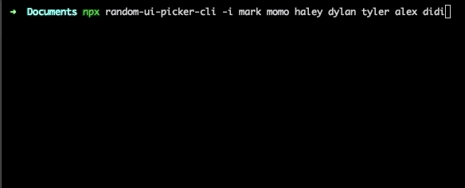
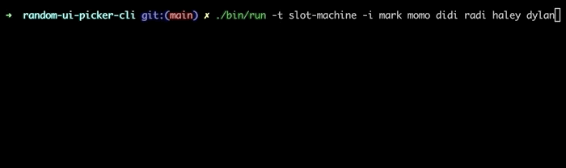

# random-ui-picker-cli

This is a CLI that selects a random item with a simple UI.

## Usage

```
$ npx random-ui-picker-cli -i item1 item2 item3
$ npx random-ui-picker-cli -t basic -if items_file_path
// or
$ random-ui-picker -i item1 item2 item3
$ random-ui-picker -t basic -if items_file_path
```
```
Usage: random-ui-picker

Options:
  -t --theme <theme> theme, defuault: 'basic
  -i --items <items...>    items
  -if --items_file <path>  items's file path
  -h, --help               display help for command
```

## Theme

- **Basic**



- **Slot Machine**



## Contribute

Please make another theme!  
Other contributions are also welcome.

## How to add a theme
1. Add a new theme component to the `src` directory. (Component props must have PickerProps type)
2. Add Component with key value to **ThemeMap** in `src/index.tsx`.
3. Enter the following in the terminal.
```
$ yarn start -t [new theme name] -i item1 item2 item3
```